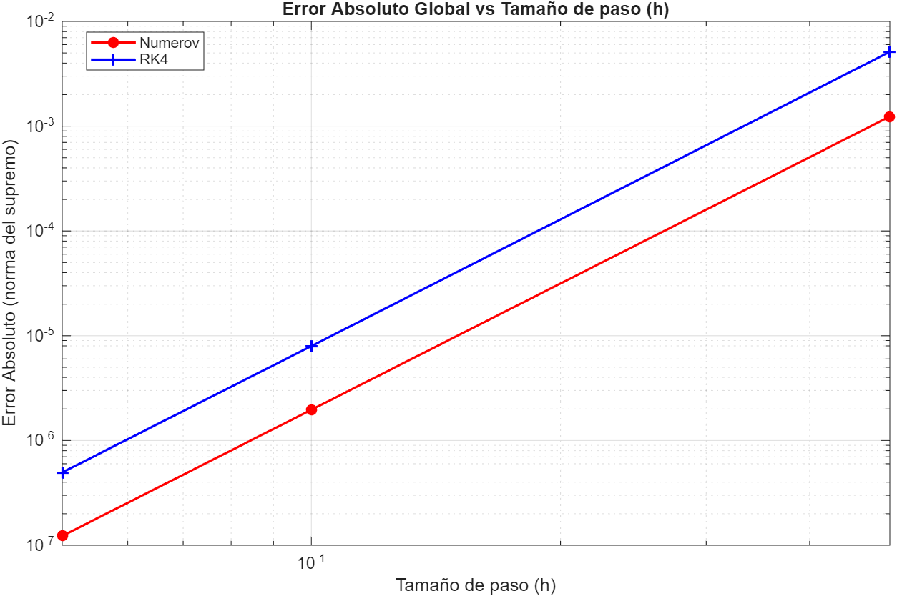

# Benchmarking y Análisis de Estabilidad Numérica: Método de Numerov vs. Runge-Kutta 4

Este repositorio contiene una suite computacional desarrollada desde cero en **MATLAB** (compatible con GNU Octave) para la simulación numérica, resolución de autovalores y benchmarking de algoritmos de orden 4 aplicados a problemas con valores en la frontera (BVP), tomando como caso de estudio la **Ecuación de Schrödinger unidimensional para una partícula libre** ($V(x) = 0$).

## Descripción del Proyecto
El objetivo principal de este estudio es realizar un análisis cuantitativo riguroso que evalúe el rendimiento algorítmico, el coste computacional en tiempo de ejecución y la estabilidad matemática de dos métodos numéricos de cuarto orden:
1. **Método de Numerov:** Algoritmo explícito de diferencias finitas optimizado para ecuaciones diferenciales lineales de segundo orden sin término de primera derivada ($y'' = -k^2(x)y$).
2. **Método de Runge-Kutta 4 (RK4):** Algoritmo estándar de paso a paso reduciendo el orden de la ecuación diferencial al sistema dual de primer orden.

## Metodología Analítica y Tecnologías
* **Lenguaje:** MATLAB / GNU Octave
* **Benchmarking y Profiling:** Medición experimental del tiempo de ejecución (CPU time) mediante funciones de temporización (`tic`/`toc`) para cada tamaño de paso discretizado ($h$).
* **Análisis de Error:** Evaluación del error absoluto global computado bajo la **norma del supremo** ($L_\infty$) comparando las aproximaciones numéricas contra la solución analítica exacta ($\psi(x) = \sin(\sqrt{E}x)$).
* **Cálculo del Orden de Convergencia:** Determinación experimental de la pendiente y orden de convergencia global algorítmico aplicando regresión lineal polinomial (`polyfit`) en representación logarítmica dual (`loglog`).

## Estructura de los Scripts
* `eq_schrodinger.m`: Script ejecutable que corre las simulaciones iterativas para los vectores discretos de paso $h = [0.5, 0.1, 0.05]$, calcula normas de error, ejecuta los ajustes polinomiales y despliega las métricas en consola.
* `numerov.m`: Implementación vectorial explicita del Método de Numerov calculando los coeficientes auxiliares de potencial $k^2(t)$.
* `rk4.m`: Implementación del método estándar de Runge-Kutta de 4 etapas adaptado para sistemas de derivadas de segundo orden mediante variables de estado duales ($y, v$).

## Resultados y Gráficas
El sistema genera automáticamente visualizaciones comparativas en subgráficos de la solución numérica frente a la analítica, así como la curva de convergencia global en escala logarítmica:

### Conclusiones Computacionales
Al ejecutar el modelo se comprueba empíricamente cómo el **Método de Numerov optimiza el tiempo computacional** frente a RK4 para ecuaciones de la forma $y'' = f(x, y)$, manteniendo la estabilidad del orden de convergencia de cuarto orden ($O(h^4)$) con un menor número de evaluaciones funcionales por iteración.
